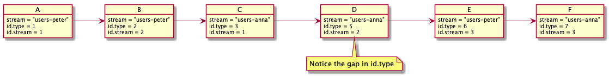

# Event Stream IDs

Streams are identified by a string. An example stream id could be `messages`.
All messages appended directly to this stream would gain a specific sequence number that
is strictly sequential.

Streams can be organized in types. This is done by adding a prefix type name separated by a dash (`-`).

For example the stream id `users-peter` would identify `peter` of the type `users`.

Subscribers of streams can subscribe to specific streams `users-peter`.
Alternatively you can subscribe to streams by its type. 
Subscribing to `users` would grant you all messages appended to both `users-peter` and `users-anna`.

It is important to see how ordering works for the two different cases.

Image a system with five messages: A to F as in the above picture

Subscribing to a specific stream (ie `users-peter`) would provide a strictly
sequential ordering of the messages. It would be like this:

*Subscribing to `users-peter`*

Message | Id Stream
--------|-----------
A       | 1
B       | 2
F       | 3

*Subscribing to `users-anna`*

Message | Id Stream
--------|-----------
C       | 1
D       | 2
E       | 3

*Subscribing to `users`*

Message | Id Type | Stream
--------|---------|-------------
A       | 1       | users-peter
B       | 2       | users-peter
C       | 3       | users-anna
D       | 5       | users-anna
E       | 6       | users-anna
F       | 7       | users-peter

This means you can only expect to have a higher number than your current when receiving a messages
in a type based subscriber.

